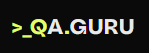

<h1 align="center">Hi there, I'm <a target="_blank">Dimitri</a> 
</h1>
<h3 align="center">Junior QAA Engineer</h3>
<h4 align="left">In this case your can find my projects completed in the course of training and practice.</h4>  

## Stack:  

<code></code>
<code></code>
<code></code>
<code></code>
<code></code>
<code></code>
<code></code>
<code></code>
<code></code>
<code></code>

## Tools and skills
 
 
 
 
 
 
 
 
 
 
 
 
 
 
 

  

## Certificates and diplomas  
<table width="100%" border='0'>
    <tr><td width="15%" valign="middle"></td><td valign="middle">Skypro. QA Engineer <a target="_blank" href="https://drive.google.com/file/d/1O1EBU1pxq6RvTFC31XtrJj9bqyPISMTW/view?usp=sharing">Certificate</a></td></tr>
    <tr><td width="15%" valign="middle"></td><td valign="middle">Skypro. QA Automation Engineer. Selenium and Python <a target="_blank" href="https://drive.google.com/file/d/1OFW-zMCFt4dPBMt2-NORSH5axeYL9ELt/view?usp=sharing">Certificate</a></td></tr>
    <tr><td width="15%" valign="middle"></td><td valign="middle">QA.GURU. QA Automation Engineer <a target="_blank" href="https://drive.google.com/file/d/13k1pRtWdwHjJ1VYe7pfxeGcwwiGOl7LM/view?usp=sharing">Certificate</a></td></tr>
    <tr><td width="15%" valign="middle"></td><td valign="middle">Stepik. Python. General course <a target="_blank" href="https://stepik.org/cert/1943362">Certificate</a></td></tr>
    <tr><td width="15%" valign="middle"></td><td valign="middle">Stepik. Python. Object-orient programming <a target="_blank" href="https://stepik.org/cert/2504463?lang=en">Certificate</a></td></tr>
    <tr><td width="15%" valign="middle"></td><td valign="middle">Stepik. Python. Extended course <a target="_blank" href="https://stepik.org/cert/2082586">Certificate</a></td></tr>
    <tr><td width="15%" valign="middle"></td><td valign="middle">Stepik. Python. API automation and programming testing <a target="_blank" href="https://stepik.org/cert/2066038">Certificate</a></td></tr>
    <tr><td width="15%" valign="middle"></td><td valign="middle">Stepik. Python. Test automation using Selenium <a target="_blank" href="https://stepik.org/cert/2118089?lang=en">Certificate</a></td></tr>
    <tr><td width="15%" valign="middle"></td><td valign="middle">Stepik. Python. Software testing: Automation. Selenium <a target="_blank" href="https://stepik.org/cert/2167510?lang=en">Certificate</a></td></tr>
    <tr><td width="15%" valign="middle"></td><td valign="middle">Stepik. Python. SQL <a target="_blank" href="https://stepik.org/cert/2560338?lang=en">Certificate</a></td></tr>
</table>

## Projects
1. Testing a web application for teachers from Skyeng. Schedule and video_practice.
<!-- - [Skyeng_schedule](https://broken-process-7e3.notion.site/1-2-3-acaea12b7d5d49369a8fd48094c18b60)
- [Skyeng_video_practice](https://broken-process-7e3.notion.site/d7533bdeb736445fb27f1fcf60f4fc13?pvs=4) -->
2. Two ways for automation tests:  
<table width="100%" border='0'>
<tr><td width="7%" valign="middle"></td><td valign="middle">Framework: "Selene". Project of auto-tests UI, API, Mobile. Site and mobile App "Autodoc"  <a target="_blank" href="https://github.com/MDN78/autodoc/tree/mobile_version_draft">AUTODOC</a></td></tr>  
<tr><td width="7%" valign="middle"></td><td valign="middle">Framework: "Selenium". Project UI and API tests. Based on services "TRELLO.COM"  <a target="_blank" href="https://github.com/MDN78/pytest_ui_api_template">TRELLO</a></td></tr>
</table>

<!-- ## Github Profile Trophy
 -->

## Follow Me
 section coming soon..  
<!--     -->

  

  

<!--   

